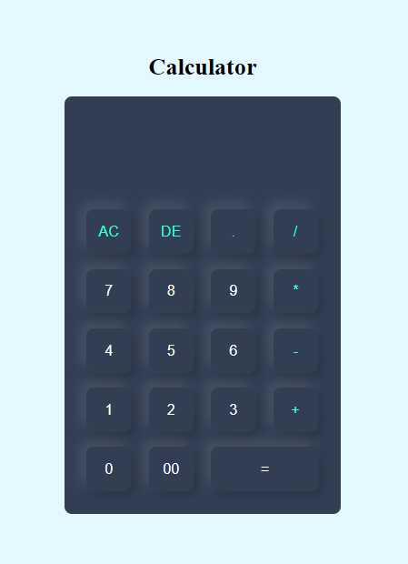

# Calculator

This is a simple calculator web application built using HTML, CSS, and JavaScript.

## Features

- Basic arithmetic operations: addition, subtraction, multiplication, and division
- Clear button to reset the calculation
- Responsive design

## Screenshot



## Technologies Used

- HTML
- CSS
- JavaScript

## Usage

1. Clone the repository:

   ```sh
   git clone https://github.com/Muhammad-Ibrar727/Calculator.git
